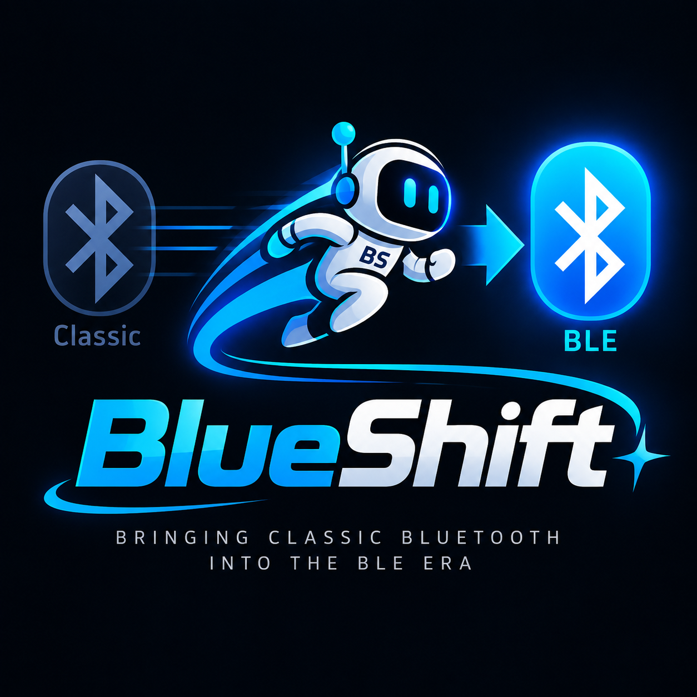
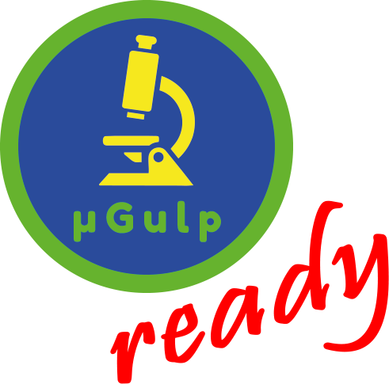

# BlueShift™

**English** | [Deutsch](README.de-DE.md)

<p align="center">
  
</p>

<p align="center">
  <a href="https://microgulp.dev/en/ready/">
    
  </a>
</p>

> **🚧 Work in Progress**
>
> This project is under active development.
> Hardware, firmware, APIs, documentation and compatibility may change.
> Nothing is physically VERIFIED until a T-Lion board is tested.

**Bringing Classic Bluetooth into the BLE era.**

**BlueShift™** is the project and product name by Meinolf Amekudzi — a bridge from **Classic Bluetooth HID** (BR/EDR) to **BLE HID**, initially intended for the **LILYGO T-Lion** board.

Package / repo identifier (ASCII): `blueshift` — public wording **BlueShift™** (word mark; not in technical identifiers). Details: [`docs/licensing/branding-policy.md`](docs/licensing/branding-policy.md).

**Status:** Milestone 5 — audio expansion feasibility (`0.5.0-dev`). HID V1 path unchanged. Experimental ESP][ speaker-to-A2DP architecture under development (protocol + edge→PCM host-tested; A2DP/triple-role spikes). Physical T-Lion **not yet** available — **nothing PHYSICALLY VERIFIED**.

---

## Purpose

Many HID devices (gamepads, keyboards) speak only **Bluetooth Classic**. Modern hosts and ESP32-S3 projects such as **ESP][** often work reliably only with **BLE**. BlueShift accepts Classic input, normalizes it, and forwards it as BLE HID to a host.

---

## Why Classic → BLE?

| Problem | Consequence |
| --- | --- |
| Device only Classic BR/EDR | Does not appear in ESP32-S3 BLE scans |
| Host only BLE HID | Classic controllers cannot be used |
| Vendor names unreliable | Profiles need descriptor / VID/PID logic |

BlueShift addresses exactly that gap — whether or not the first consumer is ESP][.

---

## Documentation status levels

| Level | Meaning |
| --- | --- |
| **VERIFIED** | Confirmed on physical BlueShift hardware |
| **DOCUMENTED** | Manufacturer / schematic evidence; not yet measured here |
| **IMPLEMENTED_UNVERIFIED** | Code present / builds / tested; not run on our T-Lion |
| **EXPERIMENTAL** | Present; verification incomplete |
| **PLANNED** | Architecture / goal; not built yet |
| **ASSUMED** | Working assumption; must be verified |
| **INCOMPATIBLE** | Ruled out with documented reason |
| **UNKNOWN** | Insufficient evidence |

Until the T-Lion is physically tested, OLED, battery, Classic BT, BLE and PSRAM must **not** be labeled VERIFIED.

---

## Intended hardware (T-Lion)

Dossier: [`docs/hardware/t-lion.md`](docs/hardware/t-lion.md) (schematic `t18_v2.3.pdf` + official LilyGO example).

| | | Confidence |
| --- | --- | --- |
| Board | LILYGO T-Lion / T-Controller / T18 | DOCUMENTED |
| MCU | ESP32-WROVER | DOCUMENTED |
| OLED | SSD1306 128×64 I²C `0x3C`, SDA21/SCL22 | DOCUMENTED |
| 5-way | GPIO 32/33/34/36/39 | DOCUMENTED |
| Battery ADC | GPIO35, divider ×2 | DOCUMENTED |
| Charger | TP5400 | DOCUMENTED |
| USB-UART | Schematic CP2104 vs marketing CH9102 | CONFLICT / UNKNOWN |
| Cell protection | Not fully evidenced | UNKNOWN |

PlatformIO: `skeleton` (esp32dev smoke) + `t-lion-debug` / `t-lion-release` (custom board JSON, **IMPLEMENTED_UNVERIFIED**).

---

## Architecture (IMPLEMENTED_UNVERIFIED)

```
Classic HID Device
        |
ClassicHidHostSpike (stub / mock; radio later)
        |
   Raw HID Report
        |
 Device Parser / Profile
        |
 Normalized Input
        |
    BridgeCore
        |
 BLE report builder / BleHidPeripheralSpike
        |
   BLE-only Host
```

In `components/` (host tests without radio):

- T-Lion board facade (no app GPIO hardcodes)
- SSD1306 via ThingPulse (`t-lion-*` only) + framebuffer for host/skeleton
- OLED UI renderer (Status/Pair/Devices/Profiles/Diagnostics/Settings/About)
- GPIO nav + ADC battery backends (DOCUMENTED pins)
- NVS `ConfigStore` + factory-reset orchestration
- Classic/BLE spikes with timeouts; dual-radio deliberately **not** default-linked
- E2E simulation, stuck-key / disconnect / malformed-HID tests
- i18x en-US/de-DE for current UI strings

Stack decision: [`docs/bluetooth/m3-stack-decision.md`](docs/bluetooth/m3-stack-decision.md).

---

## Compatibility database

One structured source: [`docs/compatibility/devices.json`](docs/compatibility/devices.json).

Generated from [`docs/compatibility/devices.json`](docs/compatibility/devices.json). Do not edit this table by hand.

**BlueShift** = Classic HID input → BLE HID output bridge candidacy. **ESP][** = direct wireless use on the ESP32-S3 ESP][ project. These are different questions.

| Device | Transport | BlueShift | ESP][ direct | Physical test | Notes |
| --- | --- | --- | --- | --- | --- |
| 8BitDo SN30 Pro | classic-br-edr | CANDIDATE | INCOMPATIBLE | NONE | Do not claim BlueShift VERIFIED until Classic HID path is physically tested on T-Lion. |
| SteelSeries Nimbus 69070 | classic-br-edr | CANDIDATE | INCOMPATIBLE | PARTIAL | Classic-path feasibility for BlueShift is PLANNED / CANDIDATE — not yet verified on T-Lion. |
| Microsoft Xbox Controller 1697 | proprietary-wireless, usb | USB_ONLY | INCOMPATIBLE | NONE | USB-oriented; out of scope for Classic→BLE bridge without contrary evidence. |
| Terios / ShanWan T3 BM-769 | ble | NOT_APPLICABLE | CANDIDATE | PENDING | Ordered / physical verification pending for ESP][. Not a primary BlueShift Classic-input target. |
| VR PARK Controller | ble | NOT_APPLICABLE | CANDIDATE | PARTIAL | ESP][ path: BLE discovered. BlueShift Classic bridge is not the primary interest for this device. |

### Evidence / references

- bluepad32SupportedGamepads: https://bluepad32.readthedocs.io/en/latest/supported_gamepads/
- bluepad32Issue154: https://github.com/ricardoquesada/bluepad32/issues/154
- esp32KeyBridge: https://github.com/tanakamasayuki/ESP32KeyBridge
- **8BitDo SN30 Pro**: Classic Bluetooth / BR/EDR gamepad; candidate future BlueShift Classic HID input. Not suitable for direct ESP32-S3 BLE wireless use on ESP][. ([link](https://bluepad32.readthedocs.io/en/latest/supported_gamepads/))
- **SteelSeries Nimbus**: Physically tested against ESP][ BLE scanner: visible to Windows Bluetooth, NOT visible in ESP32-S3 BLE scan. Therefore direct ESP][ BLE wireless: INCOMPATIBLE. Candidate BlueShift Classic input.
- **Microsoft Xbox Controller**: No normal Bluetooth Classic/BLE HID for wireless use. Do not classify as BlueShift Classic HID candidate without new evidence.
- **Terios / ShanWan T3**: Inexpensive BLE controller discussion relevant to direct ESP][ use (not primary BlueShift Classic-input target). ([link](https://github.com/ricardoquesada/bluepad32/issues/154))
- **VR PARK Controller**: Physically visible in ESP32-S3 BLE scan on ESP][. Deeper HID/GATT analysis pending. Direct ESP][ candidate.


---

## Development

### PlatformIO

```text
platformio.ini   — skeleton / t-lion-debug / t-lion-release / native
src/main.cpp     — boot skeleton + documented pin logs
include/blueshift/version.h  — 0.5.0-dev
```

Pinned: `espressif32 @ 6.9.0`. Bluetooth stacks are **not** yet `lib_deps`.

```bash
pio run -e skeleton
pio run -e t-lion-debug
pio run -e native          # host unit tests
npm run test:infra
```

### µGulp / Gulp

```bash
npm install
npx gulp help          # default — safe
npx gulp docs          # README.md + README.de-DE.md + compatibility table
npx gulp format        # clang-format (if installed)
npx gulp format:check
npx gulp check
npx gulp backup:git    # explicit checkpoint (dry-run: BLUESHIFT_BACKUP_GIT_DRY_RUN=1)
npx gulp backup        # NAS 0–3 destinations
npx gulp backup:nas    # alias
npx gulp backup:all
```

Default / `help` does **not** build firmware, commit, or touch NAS.

NAS destinations: `NAS_TARGET_1` … `NAS_TARGET_3` or `config/nas.targets.example` → `nas.targets.local` (gitignored). Zero destinations are valid.

### Formatting

`.clang-format` follows project rules (4 spaces, brace attach). Tasks `format` / `format:check` need `clang-format` on PATH or `CLANG_FORMAT`. If missing, tasks report clearly — the project does not depend on an undocumented global install.

### i18x

Stub under `components/i18n/` and notes in `docs/i18x/`. Locales: `en-US` (fallback), `de-DE`. Compatible with the project-family i18x approach; no second engine.

### Tests

```bash
npm run test:infra
npm run test:host
```

---

## µGulp-ready

This repository uses the **µGulp** automation workflow for:

- documentation generation (`gulp docs`)
- README localization sources (en-US / de-DE)
- infrastructure validation (`npm run test:infra`)
- C/C++ formatting helpers (`gulp format` / `format:check`)
- Git checkpoints (`gulp backup:git`)
- NAS backup when configured (`gulp backup` / `backup:nas` / `backup:all`)

µGulp-ready badge: official artwork at `docs/assets/microgulp-ready.png` ([rules](https://microgulp.dev/en/ready/)).

---

## Project status

| Area | Level |
| --- | --- |
| Repository / µGulp / docs | Milestone 1+2 foundation |
| T-Lion dossier / schematic | DOCUMENTED |
| PlatformIO `t-lion-*` | IMPLEMENTED_UNVERIFIED |
| Bridge / HID / UI logic (host tests) | IMPLEMENTED_UNVERIFIED |
| Classic BT / BLE stack in firmware | PLANNED (research done) |
| Physical verification | pending |

Version: **0.5.0-dev**. Next physical step: **T-LION HARDWARE BRING-UP** (`t-lion-idf-debug`).

---

## Relationship to ESP][

ESP][ is the first intended consumer (ESP32-S3 Apple II emulator project). BlueShift remains a **standalone** open-source project and is not ESP][-specific.

---

## Roadmap (short)

1. **Milestone 1** — repository foundation
2. T-Lion hardware bring-up (OLED, buttons, battery, diagnostics)
3. Classic HID input (one device, one profile)
4. BLE HID output + minimal bridge
5. Reconnect, profiles, compatibility growth

### Experimental / Roadmap (audio)

**Experimental ESP][ speaker-to-A2DP architecture under development.**

Not a finished “Bluetooth audio bridge”. See [`docs/audio/architecture.md`](docs/audio/architecture.md).
HID bridging remains the primary V1 capability.

---

## Licensing

The final BlueShift project license is being prepared.

The project is intended to remain freely available for personal use, hobby, education, research and other non-commercial purposes.

Interested in manufacturing, distribution, integration or sale of BlueShift or BlueShift-based hardware? Please contact the project author about commercial licensing or OEM arrangements:

- Repository: https://github.com/mamekudz/BlueShift
- Issues: https://github.com/mamekudz/BlueShift/issues
- Profile: https://github.com/mamekudz

Third-party components remain under their own licenses
([`THIRD_PARTY_LICENSES.md`](THIRD_PARTY_LICENSES.md),
[`docs/licensing/license-audit.md`](docs/licensing/license-audit.md)).

Bluepad32 / BTstack / ESP32KeyBridge / EspBle are **referenced, not vendored**. A BlueShift license does not replace those projects’ licenses (for BTstack especially BlueKitchen commercial terms).

Trademark / logo rights are separate from the software license; see
[`docs/licensing/branding-policy.md`](docs/licensing/branding-policy.md) and
[`docs/licensing/license-policy-draft.md`](docs/licensing/license-policy-draft.md)
(**policy draft, not legal text**).

Word mark: **BlueShift™** (not ®). Graphic logo: draft — trademark treatment **UNDECIDED**.

BlueShift logo draft: `docs/assets/blueshift-logo.png` (full color; OLED mono later separately) — no automatic trademark rights for commercial products.
